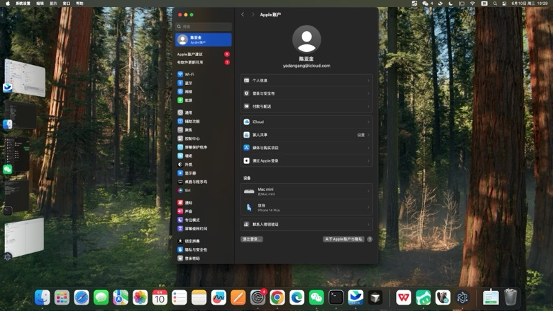

# MD Reader

> 📝 Markdown 在线阅读器 - 左侧编辑，右侧实时预览

[](https://github.com/chenyajin/md-reader)
[](https://github.com/chenyajin/md-reader)
[](https://github.com/chenyajin/md-reader/stargazers)

## ✨ 功能特性

- 📝 **实时预览** - 左侧编辑 Markdown，右侧即时显示渲染效果
- 📂 **文件操作** - 打开、保存 .md 文件
- 📄 **导出 HTML** - 将 Markdown 导出为独立的 HTML 文件
- 🌓 **主题切换** - 支持亮色/暗色主题
- ⊞ **布局切换** - 垂直/水平分屏布局
- 🔗 **同步滚动** - 编辑区和预览区同步滚动
- ⌨️ **快捷键支持** - Cmd+O 打开、Cmd+S 保存、Cmd+E 导出

## 📸 应用截图



*左侧：Markdown 编辑区 | 右侧：实时预览区*

## 🚀 快速开始

### 下载安装

#### 方式一：下载发布版本（推荐）

1. 前往 [Releases](https://github.com/chenyajin/md-reader/releases) 页面
2. 下载最新版本的 `MD-Reader-1.0.0-mac.zip`
3. 解压后得到 `MD Reader.app`
4. 双击运行（首次运行可能需要右键 → 打开）

#### 方式二：从源码构建

```bash
# 克隆仓库
git clone https://github.com/chenyajin/md-reader.git
cd md-reader

# 安装依赖
npm install

# 启动应用（开发模式）
npm start

# 打包应用
npm run dist:dmg
```

### 首次运行说明

由于应用未签名，macOS 可能会阻止运行。请按以下步骤操作：

**方法一（推荐）**：
1. 按住 **Control 键**，点击 `MD Reader.app`
2. 选择 **"打开"**
3. 在弹出的对话框中再次点击 **"打开"**

**方法二**：
1. 直接双击 `MD Reader.app`（会提示无法打开）
2. 打开 **系统设置 > 隐私与安全性**
3. 滚动到底部，点击 **"仍要打开"**
4. 再次点击 **"打开"**

## 📖 使用指南

### 1. 打开 Markdown 文件

- 点击工具栏的 **"📂 打开文件"** 按钮
- 或者按快捷键 **Cmd + O**
- 选择 .md 文件，内容会自动加载到编辑区

### 2. 编辑并预览

- 在左侧编辑区修改 Markdown 内容
- 右侧预览区会**实时更新**显示渲染效果
- 支持所有标准 Markdown 语法（标题、列表、代码块、表格等）

### 3. 保存文件

- 点击 **"💾 保存"** 按钮
- 或者按快捷键 **Cmd + S**
- 如果是新文件，会选择保存位置

### 4. 导出 HTML

- 点击 **"📄 导出HTML"** 按钮
- 或者按快捷键 **Cmd + E**
- 会生成一个独立的 .html 文件，可在浏览器中打开

### 5. 切换主题

- 点击右上角的 **"🌓"** 按钮
- 在亮色/暗色主题之间切换

### 6. 切换布局

- 点击右上角的 **"⊞"** 按钮
- 在垂直分屏/水平分屏之间切换

### 7. 同步滚动

- 点击编辑区右上角的 **"🔗"** 按钮
- 开启/关闭同步滚动功能

## ⌨️ 快捷键

| 快捷键 | 功能 |
|--------|------|
| `Cmd + O` | 打开文件 |
| `Cmd + S` | 保存文件 |
| `Cmd + E` | 导出 HTML |
| `Cmd + Q` | 退出应用 |

## 🛠️ 技术栈

- **框架**: [Electron](https://www.electronjs.org/) - 跨平台桌面应用框架
- **Markdown 解析**: [marked](https://github.com/markedjs/marked) - 高性能 Markdown 解析器
- **样式**: [GitHub Markdown CSS](https://github.com/sindresorhus/github-markdown-css) - GitHub 风格的 Markdown 渲染样式

## 📦 项目结构

```
md-reader/
├── main.js          # Electron 主进程
├── preload.js       # 预加载脚本（安全桥接）
├── index.html       # 应用主页面
├── renderer.js      # 渲染进程逻辑
├── style.css        # 应用样式
├── package.json     # 项目配置
└── README.md        # 项目说明
```

## 🤝 贡献

欢迎提交 Issue 和 Pull Request！

1. Fork 本仓库
2. 创建你的特性分支 (`git checkout -b feature/AmazingFeature`)
3. 提交你的更改 (`git commit -m 'Add some AmazingFeature'`)
4. 推送到分支 (`git push origin feature/AmazingFeature`)
5. 打开一个 Pull Request

## 📄 许可证

本项目采用 MIT 许可证 - 查看 [LICENSE](LICENSE) 文件了解详情

## 🙏 致谢

- [Electron](https://www.electronjs.org/) - 让 Web 技术构建桌面应用成为可能
- [marked](https://github.com/markedjs/marked) - 快速的 Markdown 解析器
- [GitHub Markdown CSS](https://github.com/sindresorhus/github-markdown-css) - 漂亮的 Markdown 样式

## 📧 联系方式

- GitHub: [@chenyajin](https://github.com/chenyajin)
- 项目地址: https://github.com/chenyajin/md-reader

---

⭐ 如果这个项目对你有帮助，请给它一个 Star！
